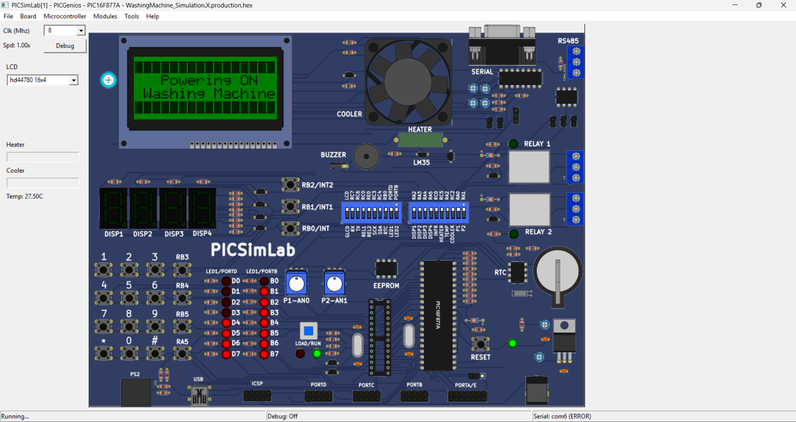
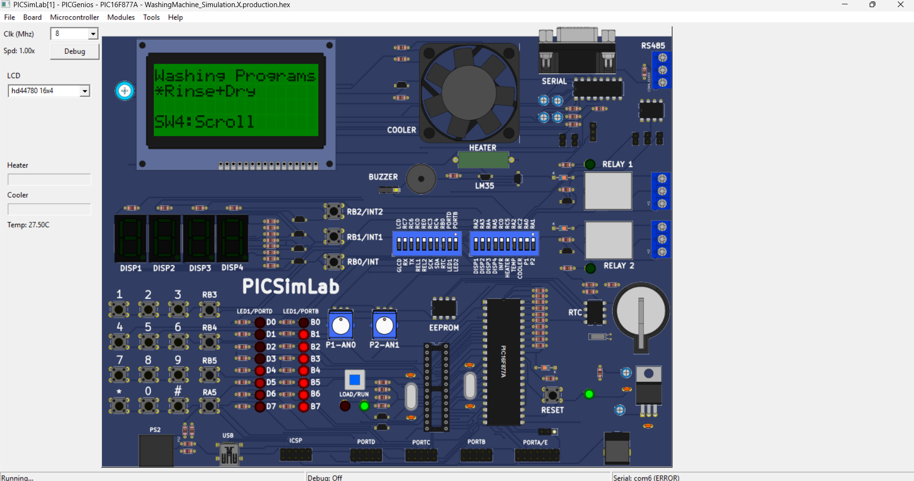
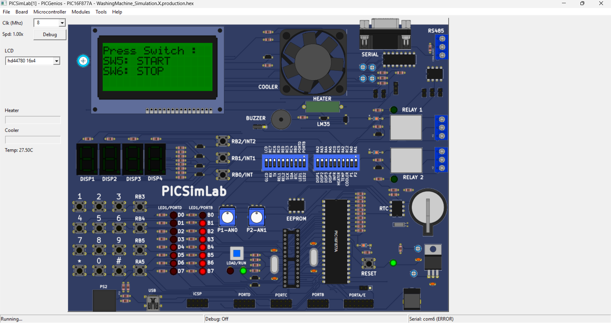

# Washing Machine Controller – PIC16F877A

A menu-driven washing machine controller implemented using PIC16F877A microcontroller and simulated in PICSimLab.  
The project demonstrates embedded system design including keypad input, LCD interface, timers, and safety interlocks.

## Features
- Power ON welcome screen  
- Program selection (Wash, Rinse+Dry, Dry only, etc.)  
- Water level selection (Low, Medium, High, Max, Auto)  
- Start / Stop / Pause control  
- Real-time wash mode running timer  
- Door open safety interlock  
- Program completion notification  

## Tools Used
- MPLAB X IDE  
- XC8 Compiler  
- PICSimLab (PICGenios board)  

## Folder Structure
- `WashingMachine.X/src` → All C source and header files  
- `screenshots` → Simulation result screenshots  

## How It Works (Brief Logic)
1. User selects program using keypad  
2. User selects water level  
3. Controller waits for START command  
4. Wash cycle runs using timer interrupts  
5. Safety checks: door status monitored continuously  
6. On completion, system displays completion message and returns to menu  

## How to Run
1. Open project in MPLAB X  
2. Build to generate `.hex` file  
3. Load `.hex` in PICSimLab (PICGenios board)  
4. Run simulation and interact using keypad  

## Simulation Results

### Power ON

### Program Selection

### Water Level Selection

### Start / Stop Control

### Wash Mode Running

### Door Open Safety

### Program Complete

## Author
**Likhith Gowda H R**  
Electronics and Communication Engineering  
